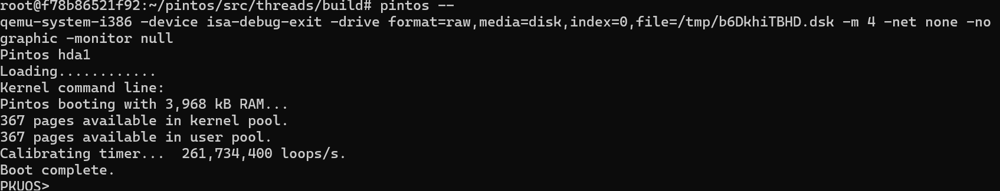
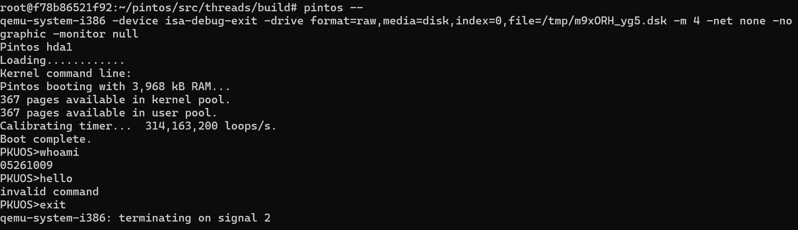

# Project 0: Getting Real

## Preliminaries

>Fill in your name and email address.

Jin Gamada <jin.gamada@gmail.com>

>If you have any preliminary comments on your submission, notes for the TAs, please give them here.


>Please cite any offline or online sources you consulted while preparing your submission, other than the Pintos documentation, course text, lecture notes, and course staff.


## Booting Pintos

>A1: Put the screenshot of Pintos running example here.



## Debugging

#### QUESTIONS: BIOS 

>B1: What is the first instruction that gets executed?

ljmp

>B2: At which physical address is this instruction located?

0xffff0


#### QUESTIONS: BOOTLOADER

>B3: How does the bootloader read disk sectors? In particular, what BIOS interrupt is used?

int $0x13

>B4: How does the bootloader decides whether it successfully finds the Pintos kernel?

read_sectorの中でint$0x13をよびだし、それが失敗するとコンディションレジスタに失敗が記録されるのでjcを使ってint $0x18を呼び出す。

>B5: What happens when the bootloader could not find the Pintos kernel?

BIOSにロード失敗として実行が戻る。

>B6: At what point and how exactly does the bootloader transfer control to the Pintos kernel?

ljmp *start

#### QUESTIONS: KERNEL

>B7: At the entry of pintos_init(), what is the value of expression `init_page_dir[pd_no(ptov(0))]` in hexadecimal format?

0xc000efef

>B8: When `palloc_get_page()` is called for the first time,

>> B8.1 what does the call stack look like?
>>
```
#0  palloc_get_page (flags=(PAL_ASSERT | PAL_ZERO)) at ../../threads/palloc.c:101
#1  0xc00203b1 in paging_init () at ../../threads/init.c:167
#2  0xc002031b in pintos_init () at ../../threads/init.c:102
#3  0xc002013d in start () at ../../threads/start.S:180
```

>> B8.2 what is the return value in hexadecimal format?
>>
>> 0xc000ef7f

>> B8.3 what is the value of expression `init_page_dir[pd_no(ptov(0))]` in hexadecimal format?
>>
>> 0xc000ef7f


>B9: When palloc_get_page() is called for the third time,

>> B9.1 what does the call stack look like?
>>
```
#0  palloc_get_page (flags=PAL_ZERO) at ../../threads/palloc.c:101
#1  0xc0020a88 in thread_create (name=0xc002e970 "idle", priority=0, function=0xc0020eb7 <idle>, aux=0xc000efbc) at ../../threads/thr
ead.c:167
#2  0xc002097d in thread_start () at ../../threads/thread.c:108
#3  0xc0020334 in pintos_init () at ../../threads/init.c:121
#4  0xc002013d in start () at ../../threads/start.S:180
```

>> B9.2 what is the return value in hexadecimal format?
>>
>> 0xc000ef3f

>> B9.3 what is the value of expression `init_page_dir[pd_no(ptov(0))]` in hexadecimal format?
>>
>> 0xc000ef3f


## Kernel Monitor

>C1: Put the screenshot of your kernel monitor running example here. (It should show how your kernel shell respond to `whoami`, `exit`, and `other input`.)



#### 

>C2: Explain how you read and write to the console for the kernel monitor.

input_getc()を13つまりenterが入力されるまで読み込むことで入力した。

入力結果の表示にはputcharを、それ以外の文章の表示にはprintfを使用した。